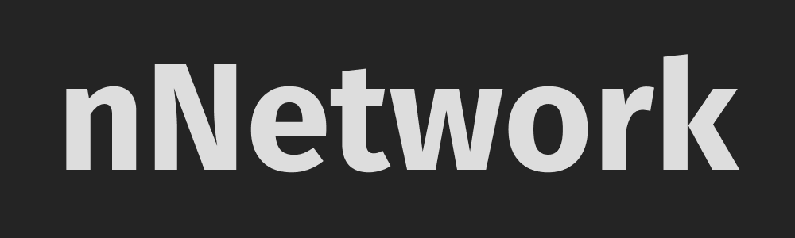

# nNetwork: A social media app just for Narayana students

## Project Architecture

- Runtime: Vanilla JavaScript (ES6+)
- Animation Engine: GSAP 3.x (Sequence-based transitions)
- Database & Auth: Supabase (PostgreSQL)
- Security: Database-level Row Level Security (RLS)

Available [here](https://narayananetwork.netlify.app "App Link")